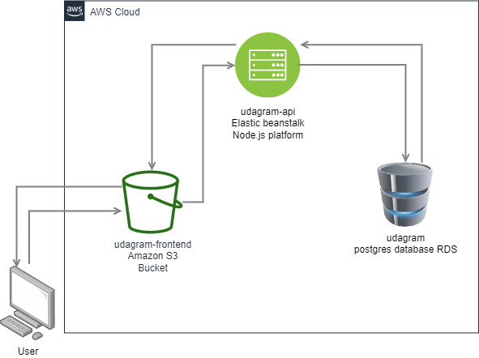

# Infrastructure

In the below diagram, client interaction between Frontend, Backend API & Database.

Client receives Angular App from `udagram-frontend` S3 Bucket which communicates with Elastic beanstalk environment `udagram-api` and elastic beanstalk communicate to `udagram` postgres database through RDS.

To explore web host Click [Here](http://poulaudagrambucket1234.s3-website-us-east-1.amazonaws.com)

